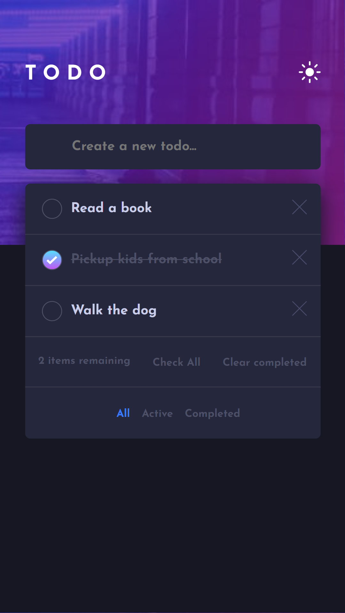

# Frontend Mentor - Todo App

This is a solution to the [Todo App challenge on Frontend Mentor](https://www.frontendmentor.io/challenges/todo-app-Su1_KokOW/hub/todo-app-AmqPxeRjL).
Frontend Mentor challenges help you improve your coding skills by building realistic projects.

## Table of contents

- [Overview](#overview)
  - [The challenge](#the-challenge)
  - [Screenshot](#screenshot)
  - [Links](#links)
- [My process](#my-process)
  - [Built with](#built-with)
  - [What I learned](#what-i-learned)
  - [Continued development](#continued-development)
  - [Useful resources](#useful-resources)
- [Author](#author)
- [Acknowledgments](#acknowledgments)

## Overview

### The challenge

Users should be able to:

- View the optimal layout for the component depending on their device's screen size
- See hover states for all interactive elements on the page
- Add new todos to the list
- Mark todos as complete
- Delete todos from the list
- Filter by all/active/complete todos
- Clear all completed todos
- Toggle light and dark mode
- **Bonus**: Drag and drop to reorder items on the list
### Screenshot

                This is a desktop View.
                 

                 This is for mobile view taken on a Pixel 2.
                 
  

   
  

  
### Links

- [Live Site URL](https://am-todo-app.netlify.app/)

## My process

### Built with

- Semantic HTML5 markup
- Flexbox
- CSS Grid
- [React](https://reactjs.org/) - JS library
- [Styled Components](https://styled-components.com/) - For styles

### Continued development

Any possible improvement

### Useful resources

- StackOverflow (Some helpful guides and tips)

## Author

- Frontend Mentor -https://www.frontendmentor.io/profile/cauathiago